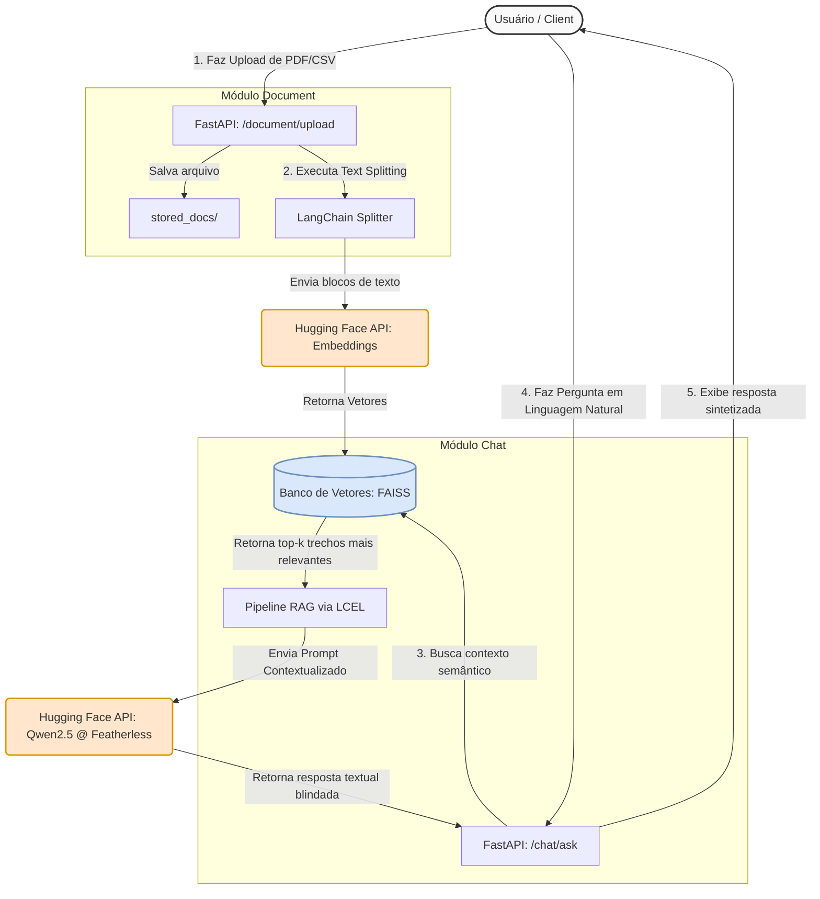

# Challenge Alura Agente - Sistema RAG Open-Source (Hugging Face & OCI)

Este projeto consiste em um Agente Inteligente baseado na arquitetura RAG (Retrieval-Augmented Generation) utilizando tecnologia open-source do ecossistema Hugging Face consumida via API Serverless. O sistema processa documentos nos formatos PDF e CSV, indexa-os localmente em um banco de vetores e responde a perguntas em linguagem natural por meio de uma interface de chat moderna.

## Arquitetura do Sistema: Monolito Modular
A solução adota o padrão de Monolito Modular centralizado dentro do diretório `app/`, garantindo portabilidade para nuvem e desacoplamento estrito de domínios:

*   **`app/backend/src/`**: API REST construída com FastAPI organizada em módulos (`document` e `chat`) via APIRouter. Orquestra o pipeline RAG utilizando a sintaxe moderna LCEL (LangChain Expression Language).
*   **`app/frontend/`**: Interface de página única (SPA) rica e reativa em Vue 3 (Composition API).



---

## Mapeamento de Diretórios do Repositório

Abaixo está a disposição completa dos arquivos do Monolito Modular e pastas de suporte:

```text
.
├── app
│   ├── backend
│   │   ├── requirements.txt
│   │   └── src
│   │       ├── config.py
│   │       ├── __init__.py
│   │       ├── main.py
│   │       └── modules
│   │           ├── chat
│   │           │   ├── __init__.py
│   │           │   ├── router.py
│   │           │   └── service.py
│   │           ├── document
│   │           │   ├── __init__.py
│   │           │   ├── router.py
│   │           │   └── service.py
│   │           └── __init__.py
│   └── frontend
├── README.md
└── samples
    ├── dados_empresa.csv
    └── diretrizes_suporte.pdf
```

---

## Estrutura de Amostras e Testes Rápidos

O repositório inclui um diretório específico na raiz do projeto contendo dados controlados para homologação imediata da busca semântica:

*   **`samples/`**: Pasta contendo arquivos estáticos para a execução de testes manuais rápidos através da documentação interativa da API.
    *   `dados_empresa.csv`: Tabela estruturada com colunas de produtos, preços e estoques para validar RAG tabular.
    *   `diretrizes_suporte.pdf`: Documento textual contendo políticas fictícias de atendimento e reembolso para validar a extração de texto longo.

---

## Stack Tecnológica (Open-Source)

*   **Framework API**: FastAPI (Assíncrono, Type Hints, Pydantic v2)
*   **Interface**: Vue 3 (Script Setup)
*   **Orquestração de IA**: LangChain via LCEL (Runnables & Pipes)
*   **Motor de IA (Serverless via Hugging Face Inference API)**:
    *   **Embeddings**: `sentence-transformers/all-MiniLM-L6-v2` (Geração de vetores via API)
    *   **LLM (Inferência RAG)**: `Qwen/Qwen2.5-1.5B-Instruct:featherless-ai` (Modelo de chat consumido de forma serverless através do roteamento direto de provedor parceiro)
*   **Banco de Vetores**: FAISS (Facebook AI Similarity Search) armazenado localmente na instância
*   **Infraestrutura Cloud**: Oracle Cloud Infrastructure (OCI) Compute Instance

---

## Como Executar o Backend Localmente

### Pré-requisitos
* Python 3.10 ou superior instalado.
* Um Token de Acesso de leitura gratuito do Hugging Face (`HUGGINGFACEHUB_API_TOKEN`).

### Passo a Passo
1. Navegue até o diretório do backend:
   ```bash
   cd app/backend
   ```

2. Crie e ative o seu ambiente virtual:
   ```bash
   python3 -m venv venv
   source venv/bin/activate  # No Windows use: venv\Scripts\activate
   ```

3. Instale as dependências:
   ```bash
   pip install -r requirements.txt
   ```

4. Configure o arquivo de variáveis de ambiente:
   * Crie o arquivo `.env` dentro de `app/backend/`:
     ```env
     HUGGINGFACEHUB_API_TOKEN=hf_seu_token_aqui
     PORT=8000
     HOST=0.0.0.0
     ```

5. Inicialização:
   ```bash
   uvicorn src.main:app --reload --port 8000
   ```
   Acesse a documentação interativa automática do Swagger em: `http://localhost:8000/docs`
