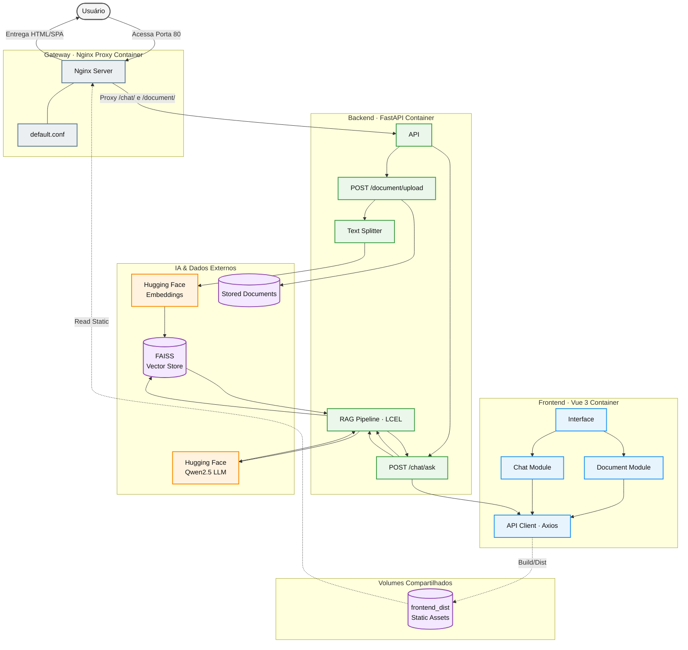
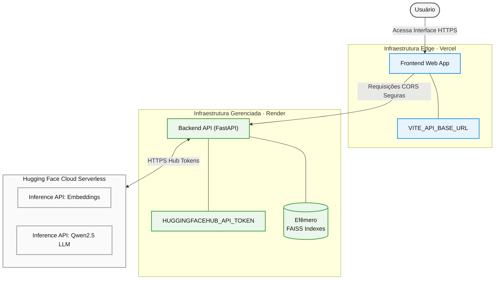

# Arquitetura do Sistema e Stack Tecnológica

O sistema adota o padrão de **Monolito Modular**, centralizado dentro do diretório `app/`, buscando manter os domínios desacoplados e facilitar a evolução e implantação em ambiente cloud. A comunicação entre o cliente e o servidor é realizada por meio de requisições assíncronas HTTP/JSON.

## Fluxo de Dados Unificado

O fluxo principal do sistema mapeia a jornada dos dados desde a interação do usuário com a interface até o processamento dos documentos e das consultas utilizando RAG.

### Ambiente Local (Docker Compose & Nginx Proxy)

O diagrama abaixo apresenta a topologia contêinerizada local, destacando o papel do `nginx_proxy` no roteamento de chamadas e no consumo do volume compartilhado de assets estáticos:

### Ambiente Nuvem (Vercel & Render via Terraform)

A topologia em nuvem representa o ecossistema gerenciado de produção atual. Os recursos são instanciados via Terraform e integrados de forma totalmente serverless:

---

## Fluxo Principal de Negócio

### Upload de documentos
* **Local:** `Usuário → Nginx Proxy → FastAPI → Text Splitter → Embeddings → FAISS`
* **Nuvem:** `Usuário → Vercel (Vue 3) → Render (FastAPI) → Text Splitter → Embeddings → FAISS (Memória/Disco Efêmero)`

### Pergunta ao sistema
* **Local:** `Usuário → Nginx Proxy → FastAPI → RAG → FAISS → Qwen2.5 → Resposta`
* **Nuvem:** `Usuário → Vercel (Vue 3) → Render (FastAPI) → RAG → FAISS → Qwen2.5 → Resposta`

---

## Stack Tecnológica

* **Framework API**: FastAPI (Assíncrono, Type Hints, Pydantic v2)
* **Interface**: Vue 3 (Script Setup) + Vite
* **Linguagem & Estilização**: TypeScript + Tailwind CSS v4 (Oxide Engine)
* **Biblioteca de Ícones**: Lucide Vue Next
* **Orquestração de IA**: LangChain via LCEL (Runnables & Pipes)
* **Motor de IA**: Hugging Face Inference API
  * **Embeddings**: `sentence-transformers/all-MiniLM-L6-v2`
  * **LLM (Inferência RAG)**: `Qwen/Qwen2.5-1.5B-Instruct:featherless-ai`
* **Banco de Vetores**: FAISS (Facebook AI Similarity Search)
* **Infraestrutura Cloud**: Servidores Serverless Dedicados (Vercel Edge Network + Render Web Services)
* **Ferramenta de Provisionamento (IaC)**: Terraform (Módulos `render` e `vercel`)
