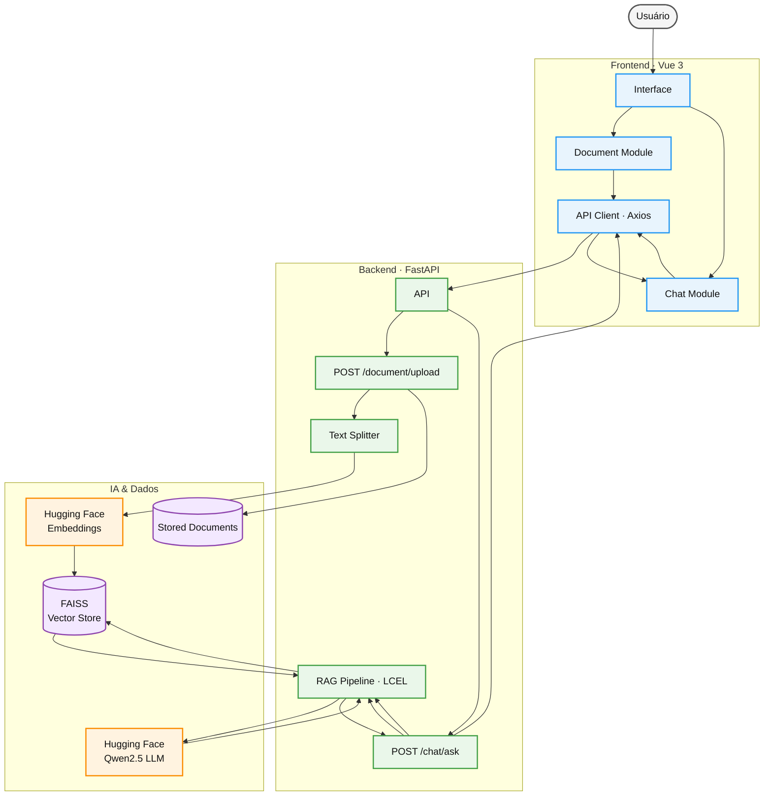

# Arquitetura do Sistema e Stack Tecnológica

O sistema adota o padrão de **Monolito Modular**, centralizado dentro do diretório `app/`, buscando manter os domínios desacoplados e facilitar a evolução e implantação em ambiente cloud. A comunicação entre o cliente e o servidor é realizada por meio de requisições assíncronas HTTP/JSON.

## Fluxo de Dados Unificado

O diagrama abaixo apresenta o fluxo principal do sistema, desde a interação do usuário com a interface até o processamento dos documentos e das consultas utilizando RAG.

### Fluxo principal

**Upload de documentos**

`Usuário → Vue → FastAPI → Text Splitter → Embeddings → FAISS`

**Pergunta ao sistema**

`Usuário → Vue → FastAPI → RAG → FAISS → Qwen2.5 → Resposta`

## Stack Tecnológica

* **Framework API**: FastAPI (Assíncrono, Type Hints, Pydantic v2)
* **Interface**: Vue 3 (Script Setup) + Vite
* **Linguagem & Estilização**: TypeScript + Tailwind CSS v4 (Oxide Engine)
* **Biblioteca de Ícones**: Lucide Vue Next
* **Orquestração de IA**: LangChain via LCEL (Runnables & Pipes)
* **Motor de IA**: Hugging Face Inference API

  * **Embeddings**: `sentence-transformers/all-MiniLM-L6-v2`
  * **LLM (Inferência RAG)**: `Qwen/Qwen2.5-1.5B-Instruct:featherless-ai`
* **Banco de Vetores**: FAISS (Facebook AI Similarity Search)
* **Infraestrutura Cloud**: Oracle Cloud Infrastructure (OCI) Compute Instance
